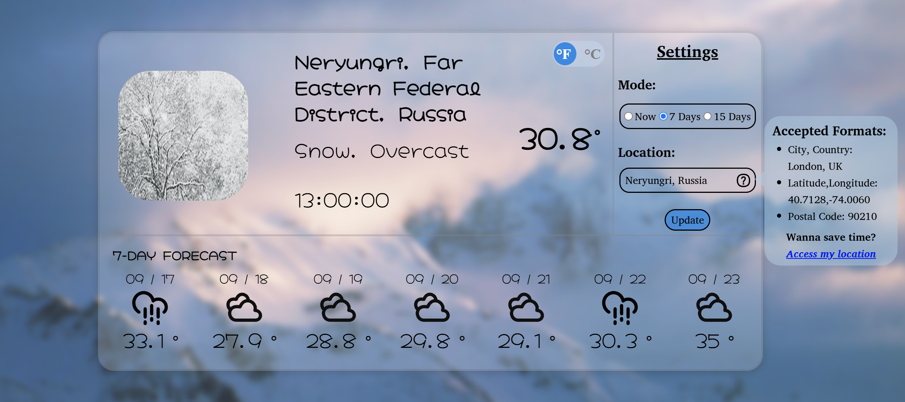
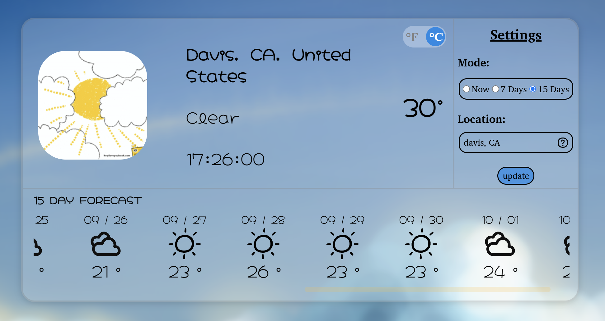

# API Weather Client

A frontend application developed as part of The Odin Project curriculum. The goal of this project is to practice concepts of asynchronous JavaScript, API integration and usage of modules.

## Previews

## Integration
**Data Fetching:** with `async/await` and Promises.
**External APIs:**
  **Visual Crossing API:** Fetching current conditions, 7-day, and 15-day forecast.
  **Giphy API:** Fetching weather sticker.
  **Reverse-Geocoding API:** Parse raw address.
**Geolocation:** Build an autofill tool to enter user's location.

### UI
**CSS Grid:** Format the main dashboard components and forecast container with Gridbox.
**Dynamic theme:** Use CSS variables to update the background image and scrollbar themes based on the active weather condition.

### Code Structure
**Modular pattern:**  Data fetching (`weatherService.js`), DOM manipulation (`interfaceModule.js`), and encapsulation (`formInit.js`, `index.js`).
**Fallback:** Additions of fallback values and error handling (`try/catch`) to ensure the app remains functional.

## Built with
* JavaScript
* HTML
* CSS
* Webpack